  <picture>
    <source media="(prefers-color-scheme: dark)" srcset="assets/hero-night.svg">
    <source media="(prefers-color-scheme: light)" srcset="assets/hero-day.svg">
    
  </picture>

  <picture>
    <source media="(prefers-color-scheme: dark)" srcset="assets/about-night.svg">
    <source media="(prefers-color-scheme: light)" srcset="assets/about-day.svg">
    
  </picture>

  <picture>
    <source media="(prefers-color-scheme: dark)" srcset="assets/toolkit-night.svg">
    <source media="(prefers-color-scheme: light)" srcset="assets/toolkit-day.svg">
    
  </picture>

  <picture>
    <source media="(prefers-color-scheme: dark)" srcset="assets/constellation-night.svg">
    <source media="(prefers-color-scheme: light)" srcset="assets/constellation-day.svg">
    
  </picture>

  <picture>
    <source media="(prefers-color-scheme: dark)" srcset="assets/colophon-night.svg">
    <source media="(prefers-color-scheme: light)" srcset="assets/colophon-day.svg">
    
  </picture>

